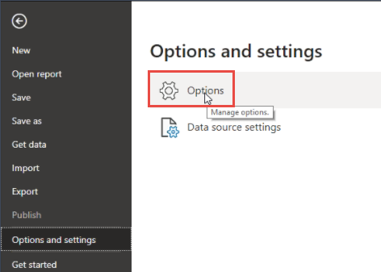

# BQE Core

## Summary

Core allows you to integrate with Microsoft Power BI. Power BI is a business intelligence service by Microsoft wherein you can track your business analytics and create reports and dashboards on it. It is a powerful tool that connects your various data sources and turns them into meaningful, centralized, visual and interactive insights for your business.

Release state: Beta

Products: Power BI Desktop, Power BI Service (Enterprise Gateway)

Authentication Types Supported: BQE Core account

## Prerequisites

To use the BQE Core PowerBI connector, you must have a BQE Core account username and password.

## Capabilities Supported

* Export

## Connect to BQE Core

To use Power BI with Core:

1. Download Microsoft Power BI from their Download Center and then install it on your computer.
     
2. Next, download the BQE Core Power BI Connector. 

3. Open this downloaded file: Power BI and then go to File > Options and settings > Options.

   

4. On the Options screen, select Security. Under Data Extensions, enable '(Not Recommended) Allow any extension to load without validation or warning.'
5. Click OK and close Power BI.  

6. Now re-open Power BI. There should be a folder in Documents called Microsoft Power BI Desktop. If there is none, manually create it with this exact name.
 

7. Within the Microsoft Power BI Desktop folder, there should be a folder called Custom Connectors. If it does not exist, manually create it with this exact name.

8. Copy and paste the downloaded BQEDataConnector.pqx file to the Custom Connectors folder.
9. Next, launch Power BI and go to File > Get Data > Other.
10. Select BQEDataConnector in the list (if it does not show up, then it is not saved in the correct Documents folder) and click Connect.
11. Click Sign In. You will be prompted to log into Core.
12. On the Log In screen, enter your Core Email and Password. Click Log in.
13. You are prompted to select your Core company file. Click Grant Permission.
14. Next, click Connect and select a module on the left (say Client). For reference, check out the Core API Documentation > API Reference.
15. Look at the Objects to get the fields; if they are filterable, look for [] that denotes the field can be expanded.

For more information, see [Alert: Core Help Center](https://corehelpcenter.bqe.com/hc/en-us/articles/360061565354-Core-Microsoft-Power-BI-integration).
